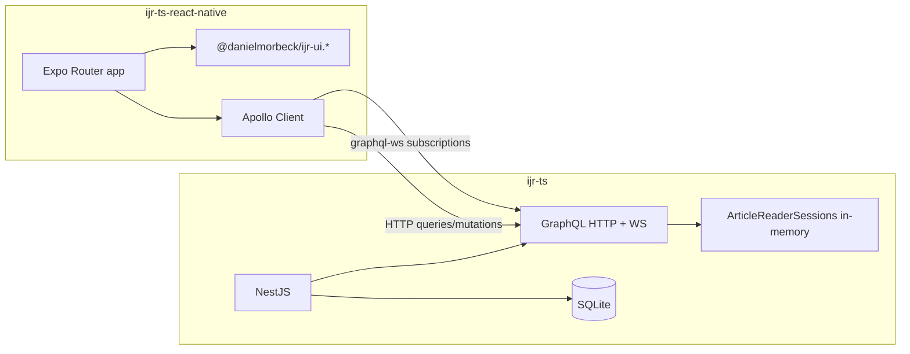

# ijr-platform

Monorepo de demonstração de um **CMS mobile**: API GraphQL em NestJS e app Expo que consome componentes UI publicados no [Bit.cloud](https://bit.cloud/danielmorbeck/ijr-ui). Inclui contador em tempo real de leitores por artigo via subscriptions `graphql-ws`.

## Visão geral e arquitetura

| Pacote                                                         | Responsabilidade                                                                      |
| -------------------------------------------------------------- | ------------------------------------------------------------------------------------- |
| [`packages/ijr-ts`](packages/ijr-ts)                           | API NestJS + GraphQL (HTTP e WebSocket), SQLite, sessões de leitura em memória        |
| [`packages/ijr-ts-react-native`](packages/ijr-ts-react-native) | App Expo 55 (Expo Router), Apollo Client, componentes Bit (`@danielmorbeck/ijr-ui.*`) |

Para exemplos completos de queries, mutations e subscriptions GraphQL, consulte o [README do backend](packages/ijr-ts/README.md).



## Como rodar

### Pré-requisitos

| Ferramenta  | Versão                                           | Obrigatório para                         |
| ----------- | ------------------------------------------------ | ---------------------------------------- |
| **Node.js** | ≥ 20                                             | Tudo                                     |
| **pnpm**    | 9.15.9 (`packageManager` na raiz)                | Tudo                                     |
| **Bit CLI** | via [bvm](https://bit.dev/reference/cli/install) | App mobile (compilar/linkar componentes) |

### Escolha o fluxo de setup

Este monorepo mistura um pacote Node comum (`ijr-ts`) com um **workspace Bit** dentro de `ijr-ts-react-native`. O `pnpm install` na raiz dispara um **postinstall** no app mobile que executa `bit compile && bit link`.

| Objetivo         | Instalação                        | Depois                                    |
| ---------------- | --------------------------------- | ----------------------------------------- |
| Só API / GraphQL | `pnpm install --ignore-scripts`   | [Rodar só o backend](#rodar-só-o-backend) |
| API + app Expo   | [Setup completo](#setup-completo) | [Rodar end-to-end](#rodar-end-to-end)     |

> Instale dependências **sempre na raiz do monorepo** (`pnpm install`). Não use o `pnpm-lock.yaml` interno de `packages/ijr-ts-react-native` para setup do projeto inteiro.

---

### Por que o `pnpm install` pode falhar?

Em um **clone novo** (outra pasta, CI, máquina sem Bit configurado), o postinstall do mobile pode falhar com:

```text
your workspace has outdated objects. please use "bit import" to pull the latest objects from the remote
(specifically: danielmorbeck.ijr-ui/article-card@0.0.1)
```

Isso **não indica** problema no pnpm ou no Node. Acontece porque:

1. **`.bit/` não vai para o Git** — o cache interno do Bit fica só na máquina local; o clone traz código em `components/` e o `.bitmap`, mas não o estado compilado.
2. **O postinstall exige Bit** — após instalar dependências npm, o script compila e linka componentes do scope [danielmorbeck.ijr-ui](https://bit.cloud/danielmorbeck/ijr-ui).
3. **Bit compara com o remoto** — objetos locais desatualizados fazem o `bit compile` abortar até você rodar `bit import` (com CLI instalado e login feito).

**Resumo:** `pnpm install` sozinho não é “clone e rode” para o monorepo inteiro; o app mobile exige setup explícito do Bit.

---

### Bit vs config do Expo (`tsconfig` / ESLint)

Por padrão, o Bit pode **sobrescrever** `tsconfig.json`, `.eslintrc.json` e `.prettierrc.cjs` via `bit ws-config write`, gerando arquivos que apontam para `node_modules/.cache/tsconfig.bit.*.json`. Esse tsconfig é só para **componentes Bit** (`components/article-card`, etc.) — sem `baseUrl` nem alias `@/*` do app Expo.

Se isso acontecer, o Metro falha com erros como:

```text
Unable to resolve "@/components/Themed" from "packages/ijr-ts-react-native/app/+not-found.tsx"
```

**O que este repositório faz para evitar o conflito:**

- `enableWorkspaceConfigWrite: false` em [`workspace.jsonc`](packages/ijr-ts-react-native/workspace.jsonc) — o Bit não reescreve mais os configs do workspace.
- Postinstall **sem** `bit ws-config write` — apenas `bit compile && bit link`.
- [`tsconfig.json`](packages/ijr-ts-react-native/tsconfig.json) do Expo versionado, com `baseUrl` e `paths` para `@/*`.
- ESLint do monorepo na **raiz** (`pnpm lint`); não dependa do `.eslintrc.json` gerado pelo Bit no pacote mobile.

Se você ainda vir um `tsconfig.json` que só faz `extends` de `tsconfig.bit.*.json`, restaure o arquivo Expo do Git e rode `npx expo start --clear` dentro de `packages/ijr-ts-react-native`.

---

### Rodar só o backend

Útil para validar Node, pnpm e a API sem configurar Bit.

```bash
cd ijr-platform
pnpm install --ignore-scripts
pnpm --filter ijr-ts seed          # recria data.sqlite com 6 artigos publicados
pnpm --filter ijr-ts dev           # http://localhost:3000/graphql
```

- **GraphQL HTTP:** `http://localhost:3000/graphql`
- **GraphQL WebSocket (subscriptions):** `ws://localhost:3000/graphql`

---

### Setup completo

#### 1. Instalar Bit CLI

```bash
npm i -g @teambit/bvm
bvm install
bit --version
```

#### 2. Autenticar e sincronizar componentes

É necessário acesso ao scope **`danielmorbeck.ijr-ui`** no bit.cloud.

```bash
bit login
cd packages/ijr-ts-react-native
bit import
bit compile && bit link
cd ../..
```

#### 3. Instalar dependências do monorepo

```bash
cd ijr-platform   # raiz do repositório
pnpm install
```

Se o postinstall ainda falhar, repita o passo 2 e rode `pnpm install` de novo.

Alternativa temporária (só para baixar `node_modules` sem postinstall):

```bash
pnpm install --ignore-scripts
# depois execute manualmente bit import / compile / link no pacote mobile
```

---

### Rodar end-to-end

Com backend e Bit configurados:

```bash
pnpm --filter ijr-ts seed
pnpm --filter ijr-ts dev
```

Em outro terminal:

```bash
cd packages/ijr-ts-react-native
npx expo start --clear
```

Ou, a partir da raiz:

```bash
pnpm --filter ijr-ts-react-native dev
```

**Alternativa:** após o seed, API e Expo em paralelo:

```bash
pnpm dev
```

### Dispositivo físico (mesma rede Wi‑Fi)

Em simuladores, o app costuma resolver o host da máquina automaticamente. Em **dois aparelhos físicos** na mesma rede, defina o IP da máquina que roda a API:

```bash
export EXPO_PUBLIC_GRAPHQL_HOST=<IP-da-sua-máquina>
pnpm --filter ijr-ts-react-native dev
```

Sem isso, o app no celular tenta `localhost:3000` e não alcança a API. A lógica está em [`get-api-host.ts`](packages/ijr-ts-react-native/src/apollo/get-api-host.ts).

### Artigo sugerido para demo

Após o seed, use o slug **`introducao-ao-graphql`** (primeiro artigo em [`seed.ts`](packages/ijr-ts/src/seed.ts)) para testar o contador “pessoas lendo agora” em dois dispositivos.

### Solução de problemas

| Sintoma                                          | Causa provável                                      | O que fazer                                                                                                                                    |
| ------------------------------------------------ | --------------------------------------------------- | ---------------------------------------------------------------------------------------------------------------------------------------------- |
| `outdated objects` / `bit import` no postinstall | Clone novo sem `.bit/`                              | `cd packages/ijr-ts-react-native && bit login && bit import`, depois `bit compile && bit link`                                                 |
| `bit: command not found`                         | Bit CLI não instalado                               | Instalar via bvm (passo 1 acima)                                                                                                               |
| Erro de auth / scope no `bit import`             | Sem login ou sem acesso ao scope                    | `bit login`; pedir acesso a `danielmorbeck.ijr-ui`                                                                                             |
| Quero só testar a API                            | postinstall do mobile não é necessário              | `pnpm install --ignore-scripts` + fluxo backend                                                                                                |
| `Unable to resolve "@/components/..."`           | `tsconfig.json` sobrescrito pelo Bit ou cache Metro | Confirmar `baseUrl` + `paths` no tsconfig Expo; `npx expo start --clear`; ver [Bit vs config do Expo](#bit-vs-config-do-expo-tsconfig--eslint) |
| Imports `@danielmorbeck/ijr-ui.*` não resolvem   | `bit link` não rodou                                | `cd packages/ijr-ts-react-native && bit compile && bit link`                                                                                   |

## Decisões técnicas e trade-offs

| Decisão            | Escolha atual                    | Trade-off                                       | Em produção                                       |
| ------------------ | -------------------------------- | ----------------------------------------------- | ------------------------------------------------- |
| Banco              | SQLite + TypeORM `synchronize`   | Zero setup local; sem migrations                | Postgres + migrations                             |
| Mobile             | Expo 55 (managed) + Expo Router  | Velocidade de entrega; sem código nativo custom | EAS Build; bare só se precisar de módulos nativos |
| Real-time          | `graphql-ws` + PubSub in-process | Simples; não escala horizontalmente             | Redis PubSub + adapter Apollo                     |
| Sessões de leitura | `Map` em memória no Nest         | Contador some ao reiniciar a API                | Redis/DB com TTL; sticky sessions ou heartbeat    |

## Limitações conhecidas

- O comando **seed** apaga e recria todos os dados a cada execução
- Não há **Docker** nem `.env.example` no repositório
- O **postinstall** do pacote React Native exige **Bit CLI** e `bit import` em clones novos
- O **contador de leitores** não persiste entre reinícios do servidor

## Componentes UI (Bit)

Design system publicado em: **[https://bit.cloud/danielmorbeck/ijr-ui](https://bit.cloud/danielmorbeck/ijr-ui)**

Componentes incluídos neste escopo:

- `article-card`
- `category-badge`
- `empty-state`
- `reader-counter`

## Demo em vídeo

Demonstração end-to-end do contador em tempo real (dois dispositivos no mesmo artigo).

**URL a adicionar** — substituir pelo link definitivo após o upload do vídeo.

## Scripts úteis (raiz)

| Comando      | Descrição                  |
| ------------ | -------------------------- |
| `pnpm dev`   | API + app em paralelo      |
| `pnpm build` | Build de todos os pacotes  |
| `pnpm test`  | Testes de todos os pacotes |
| `pnpm lint`  | ESLint em todos os pacotes |
